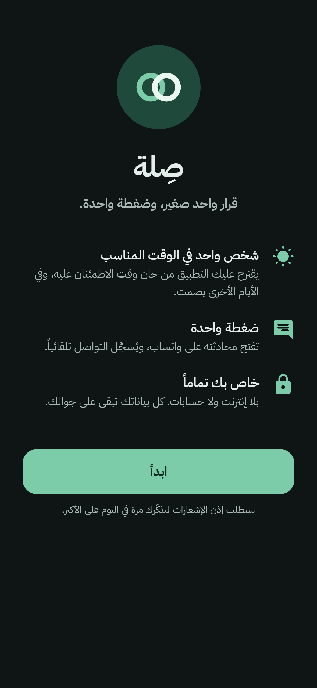
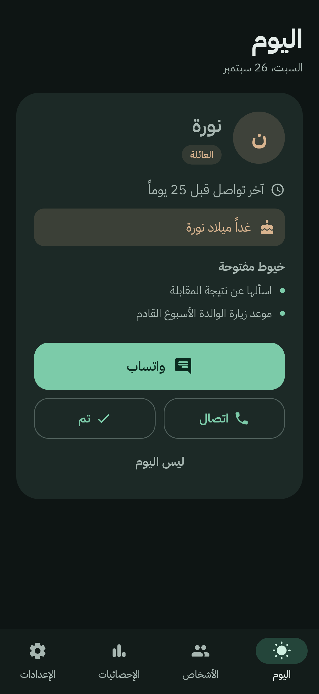
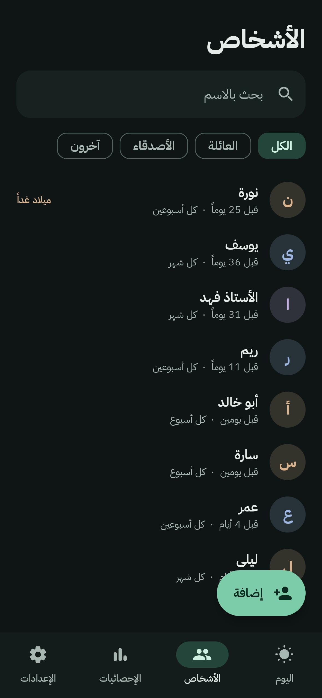
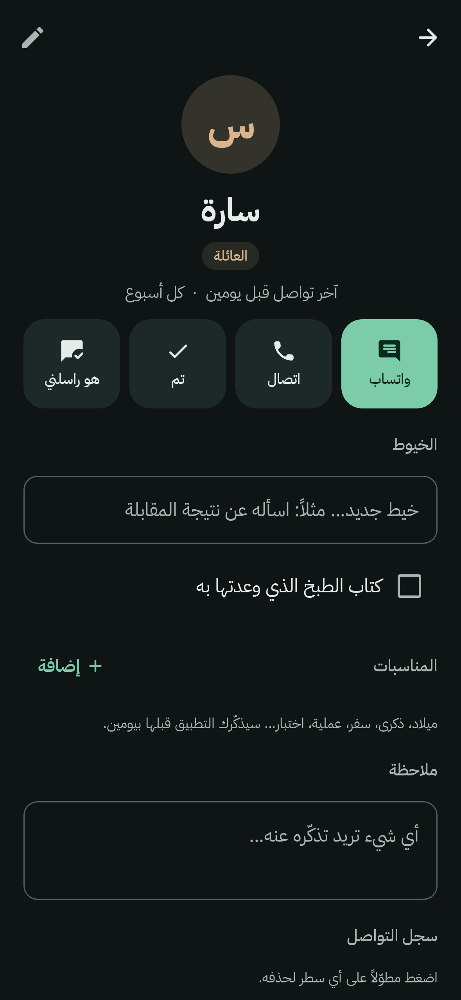
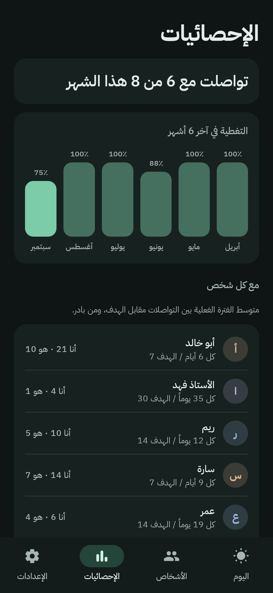
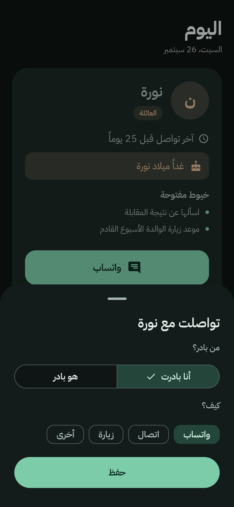
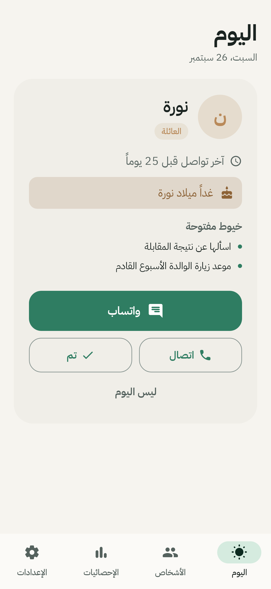
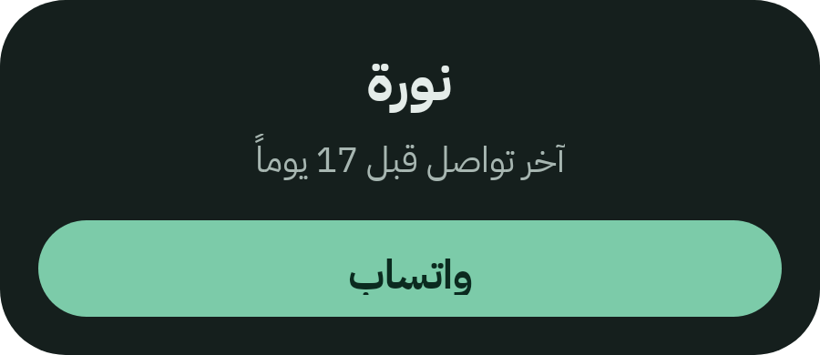

*Silah — a private, offline Android app that nudges you to keep in touch with family and friends, one person at a time.*

<div dir="rtl">

<p align="center">
  
</p>

<h1 align="center">صِلة</h1>

<p align="center"><b>قرار واحد صغير، وضغطة واحدة.</b><br>
تطبيق أندرويد يذكّرك كل يوم (أو في الأيام التي تحتاجها فقط) بشخص واحد تطمئن عليه،<br>
ويفتح محادثته على واتساب بضغطة، ويسجّل التواصل تلقائياً.</p>

<p align="center">
  <a href="https://github.com/Ahmad-Nayfeh/silah/releases/latest"><b>⬇️ تنزيل أحدث نسخة (APK)</b></a>
</p>

<p align="center">
  
  
  
  
</p>

<p align="center"><sub>كل الأسماء في الصور وهمية.</sub></p>

---

## ✨ ما الذي يفعله؟

| | |
|---|---|
| 🌤️ **شخص واحد في اليوم** | يختار لك من حان وقت الاطمئنان عليه، حسب المدة التي تحددها لكل شخص. |
| 💬 **ضغطة واحدة** | زر «واتساب» يفتح المحادثة مباشرة ويسجّل التواصل. تراجعت؟ اضغط «تراجع» خلال 10 ثوانٍ. |
| 🎂 **المناسبات** | ميلاد، ذكرى، سفر، عملية… يذكّرك قبلها بيومين: «غداً ميلاد نورة». |
| 🧵 **الخيوط** | سطر صغير تتذكره للمرة القادمة: «اسألها عن نتيجة المقابلة». |
| 🔕 **يصمت حين لا حاجة** | يحسب كم تذكيراً تحتاج في الأسبوع، وفي بقية الأيام لا إشعار إطلاقاً. |
| 🔒 **خاص تماماً** | بلا إنترنت، بلا حسابات، بلا إعلانات. بياناتك على جوالك فقط. |

---

## 📲 التثبيت (خطوة بخطوة)

> التطبيق غير موجود في متجر قوقل بلاي، وتثبيته يدوياً سهل ويأخذ دقيقة.

**1. نزّل الملف**
افتح هذا الرابط **من جوالك**: [صفحة أحدث نسخة](https://github.com/Ahmad-Nayfeh/silah/releases/latest)
ثم اضغط على الملف الذي ينتهي بـ **`.apk`** (مثل `silah-v1.0.0.apk`).

**2. افتح الملف بعد التنزيل**
من إشعار التنزيل، أو من تطبيق «ملفاتي» ← «التنزيلات».

**3. اسمح بالتثبيت**
سيقول الجوال إن التثبيت من هذا المصدر غير مسموح. اضغط **«الإعدادات»**، ثم فعّل **«السماح من هذا المصدر»**، وارجع.

**4. اضغط «تثبيت»**
قد تظهر رسالة من Play Protect بأن التطبيق غير معروف. هذا طبيعي لأي تطبيق من خارج المتجر. اختر **«التثبيت على أي حال»**.

> 💡 **على سامسونج الحديثة:** إن رفض الجوال التثبيت نهائياً، فالسبب غالباً ميزة **«الحظر التلقائي»**.
> أوقفها مؤقتاً من: **الإعدادات ← الأمان والخصوصية ← الحظر التلقائي**. ثبّت التطبيق، ثم أعد تشغيلها.
> (قد تختلف التسميات قليلاً حسب إصدار الجوال.)

---

## 🚀 أول تشغيل

1. افتح **صِلة** واضغط **«ابدأ»**.
2. عندما يسألك الجوال عن **الإشعارات**، اختر **«السماح»**. (هذا ضروري ليصلك التذكير.)
3. من تبويب **«الأشخاص»** اضغط **«إضافة»**. يكفي أن تكتب:
   - **الاسم**
   - **الوسم**: العائلة / الأصدقاء / آخرون
   - **كم مرة تودّ أن تتواصلا**: يومياً، كل 3 أيام، أسبوعياً، كل أسبوعين، شهرياً، أو مدة مخصصة
   - **الرقم** (اختياري): اكتبه أو اختره من جهات الاتصال بزر 📇
   - **متى آخر مرة تواصلتما؟** (اختياري، لكنه يجعل الاقتراحات دقيقة من اليوم الأول)
4. هذا كل شيء. ارجع لتبويب **«اليوم»** وستجد البطاقة.

<p align="center">
  
  
  
</p>

### أزرار بطاقة اليوم

| الزر | ماذا يفعل |
|---|---|
| **واتساب** | يفتح المحادثة ويسجّل التواصل فوراً. تظهر «تراجع» أسفل الشاشة 10 ثوانٍ. |
| **اتصال** | يفتح شاشة الاتصال والرقم جاهز، وأنت تضغط زر الاتصال. |
| **تم** | تواصلتما بطريقة أخرى؟ اختر من بادر (أنا / هو) وكيف (واتساب، اتصال، زيارة…). |
| **ليس اليوم** | يقترح شخصاً آخر. من قلت عنه «ليس اليوم» لا يعود قبل 3 أيام (إلا إن اقتربت مناسبته). |

وعند رجوعك من واتساب يسألك سؤالاً واحداً اختيارياً: **«خيط؟»**. اكتب سطراً تتذكره للمرة القادمة، أو اضغط **«تجاهل»**.

---

## 🔋 مهم جداً على سامسونج: لا تجعل البطارية تؤخر التذكير

سامسونج توقف التطبيقات في الخلفية لتوفير البطارية، وقد يتأخر التذكير أو لا يصل. افعل هذا **مرة واحدة**:

1. افتح **الإعدادات ← التطبيقات ← صِلة**.
   (أو من داخل صِلة: **الإعدادات ← تحسين البطارية**، وسيفتح لك الصفحة نفسها.)
2. اضغط **البطارية**.
3. اختر **«غير مقيّد»**.

وللاحتياط، تأكد أن صِلة **ليست** ضمن قائمة التطبيقات النائمة:
**الإعدادات ← العناية بالبطارية والجهاز ← البطارية ← حدود الاستخدام في الخلفية**.
إن وجدتها في «التطبيقات النائمة» أو «التطبيقات في سكون عميق» فأخرجها منها.

> ℹ️ التسميات قد تختلف قليلاً حسب إصدار One UI.

---

## 🔔 عن الإشعار

- يظهر في **وقت التذكير** (الافتراضي 7:00 مساءً، وتغيّره من الإعدادات) **فقط في الأيام التي يلزم فيها تذكير**.
- فيه ثلاثة أزرار تعمل **دون فتح التطبيق**: **واتساب**، **تم**، **ليس اليوم** (يبدّل الشخص في الإشعار نفسه).
- لا يختفي إلا بـ **واتساب** أو **تم**.
  - على أندرويد 14 وما بعده يسمح الجوال بسحب الإشعار الثابت. إن سحبته **يعود فوراً**.
- عند بداية **الهدوء الليلي** (الافتراضي 10:30 مساءً) يختفي، ويعود **صباحاً** إن بقي الشخص مستحقاً.
- بعد **إعادة تشغيل الجوال** يعود التذكير وحده.
- لا يرسل التطبيق أي إشعار آخر إطلاقاً.

---

## 🧩 الويدجت (أداة الشاشة الرئيسية)



1. اضغط مطولاً على مكان فارغ في الشاشة الرئيسية.
2. اختر **«الأدوات»**.
3. ابحث عن **صِلة** واسحب **«بطاقة اليوم»** إلى الشاشة.

تعرض اسم شخص اليوم و«آخر تواصل قبل…»، وزر **واتساب** يعمل مثل زر الإشعار. وإن لم يكن هناك أحد تعرض «لا أحد اليوم».

---

## 💾 النسخ الاحتياطي (مهم قبل تغيير الجوال)

بياناتك موجودة على جوالك فقط، ولا تُرفع لأي مكان. لذلك خذ نسخة احتياطية من وقت لآخر:

**تصدير:**
1. **الإعدادات ← تصدير نسخة احتياطية**.
2. اختر مكان الحفظ (مثلاً «التنزيلات» أو Google Drive)، واضغط **«حفظ»**.
3. سيُحفظ ملف واحد باسم مثل `silah-backup-2026-09-26.json`.

**استيراد** (على جوال جديد أو بعد إعادة التثبيت):
1. ثبّت صِلة.
2. **الإعدادات ← استيراد نسخة احتياطية ← اختيار الملف**.
3. اختر الملف. تعود كل البيانات والإعدادات كما كانت.

> ⚠️ الاستيراد **يستبدل** البيانات الموجودة بمحتوى الملف.
> ⚠️ ملف النسخة الاحتياطية فيه أسماء وأرقام حقيقية: لا ترفعه إلى GitHub ولا ترسله لأحد.

---

## 🔄 تحديث التطبيق

نزّل ملف APK الأحدث من [صفحة الإصدارات](https://github.com/Ahmad-Nayfeh/silah/releases) وثبّته **فوق** النسخة الحالية، فتبقى بياناتك.
(خذ نسخة احتياطية قبل التحديث احتياطاً.)

---

## 🧠 كيف يختار التطبيق الشخص؟

- لكل شخص **نسبة استحقاق** = الأيام منذ آخر تواصل ÷ المدة التي حددتها.
  مثلاً: «كل أسبوعين» ومرّ 21 يوماً ← النسبة 1.5.
- **الأعلى نسبة أولاً**. من لم تتواصل معه قط يأتي في المقدمة.
- **المناسبة القريبة** تقدّم صاحبها فوراً، حتى لو تواصلتما قريباً.
- من نسبته **أقل من 0.7** لا يُقترح (إلا إن كانت له مناسبة).
- **الموقوفون مؤقتاً** لا يُقترحون.
- **الإيقاع التلقائي**: يحسب كم تذكيراً يلزمك في الأسبوع لتغطية الجميع، ويوزّعها على الأسبوع. في بقية الأيام صمت تام.
  مثال: 14 شخصاً (2 أسبوعياً، 4 كل أسبوعين، 8 شهرياً) ← 6 تذكيرات في الأسبوع ويوم واحد صامت.
  ويمكنك تثبيت العدد يدوياً من الإعدادات.

---

## 🔐 الخصوصية والصلاحيات

| الصلاحية | لماذا |
|---|---|
| الإشعارات | لتذكير واحد في اليوم على الأكثر. |
| التشغيل بعد إعادة تشغيل الجوال | ليعود التذكير بعد إطفاء الجوال. |
| المنبّه الدقيق | ليصل التذكير في وقته بالضبط. |

**لا** يطلب التطبيق الإنترنت، ولا يقرأ الواتساب ولا الإشعارات ولا سجل المكالمات ولا الرسائل.
واختيار رقم من جهات الاتصال يتم عبر نافذة النظام، فيأخذ **الرقم الذي تختاره فقط**، دون صلاحية قراءة جهات الاتصال.

---

## ❓ أسئلة شائعة

**لماذا لم يصلني إشعار اليوم؟**
غالباً لأن اليوم «يوم صامت» حسب الإيقاع، أو لا أحد مستحق. هذا مقصود. إن تكرر الأمر في أيام يُفترض فيها تذكير، راجع قسم البطارية أعلاه، وتأكد أن الإشعارات مسموحة (**الإعدادات ← الإشعارات** داخل التطبيق).

**ضغطت واتساب بالخطأ.**
اضغط **«تراجع»** خلال 10 ثوانٍ. أو افتح صفحة الشخص، واضغط مطولاً على السطر في «سجل التواصل» لحذفه.

**تواصل معي هو أولاً.**
من صفحته اضغط **«هو راسلني»**، أو اضغط **«تم»** واختر **«هو بادر»**.

**أريد إيقاف شخص فترة (سفر، ظرف…).**
من صفحته فعّل **«إيقاف مؤقت»**. لن يُقترح ولن يُحسب في الإحصائيات حتى تعيده.

---

## 🛠️ للمطوّرين

<details>
<summary>البناء والاختبارات والتوقيع</summary>

**المتطلبات:** JDK 17 أو أحدث، وAndroid SDK (المنصة 35).

```bash
./gradlew testDebugUnitTest      # 63 اختباراً: منطق الاختيار، الإيقاع، الإشعار، النسخ الاحتياطي، الإحصائيات، واللقطات
./gradlew assembleDebug          # APK للتجربة
./gradlew recordRoborazziDebug   # يعيد توليد لقطات الشاشة في docs/screenshots
```

**التقنيات:** Kotlin · Jetpack Compose · Room · DataStore · AlarmManager · RemoteViews widget · Robolectric · Roborazzi.

**التوقيع:** مفتاح التوقيع **ليس** في المستودع. للبناء الموقّع محلياً أنشئ ملف `keystore.properties` في جذر المشروع (الملف مستثنى من git):

```properties
storeFile=/path/to/silah-release.jks
storePassword=...
keyAlias=silah
keyPassword=...
```

ثم: `./gradlew assembleRelease`.

**GitHub Actions:**
- `Build & test`: يشغّل الاختبارات ويبني APK عند كل push. وإن أضفت هذه الأسرار في
  *Settings ← Secrets and variables ← Actions* يبني أيضاً نسخة موقّعة:
  `SILAH_KEYSTORE_BASE64` (ناتج `base64 -w0 silah-release.jks`)، `SILAH_KEYSTORE_PASSWORD`، `SILAH_KEY_ALIAS`، `SILAH_KEY_PASSWORD`.
- `Publish release`: عند رفع `dist/silah-vX.Y.Z.apk` مع `dist/RELEASE_NOTES.md` يُنشئ إصداراً بالرقم نفسه.

**اختبار يدوي على الجوال:** راجع [docs/TESTING.md](docs/TESTING.md).

</details>

---

## 📄 الرخصة

[MIT](LICENSE). الخط المرفق **IBM Plex Sans Arabic** مرخّص بـ [SIL Open Font License](licenses/IBM-Plex-Sans-Arabic-OFL.txt).

</div>
